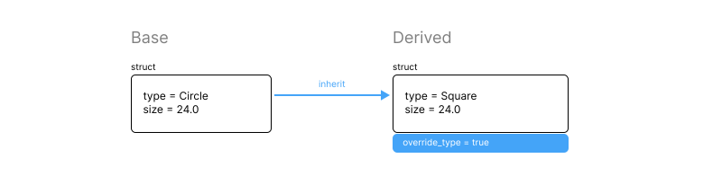
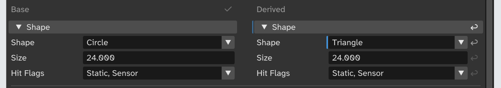
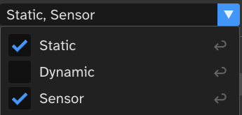
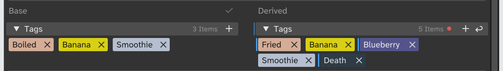
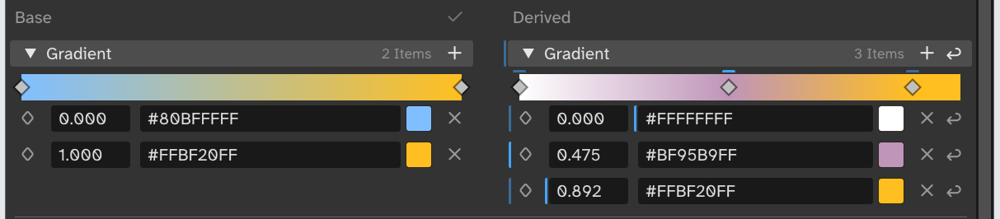
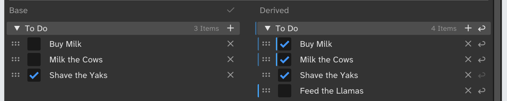
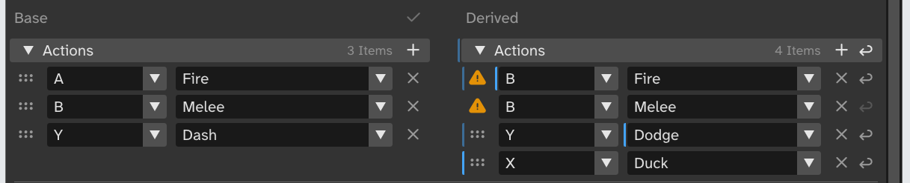
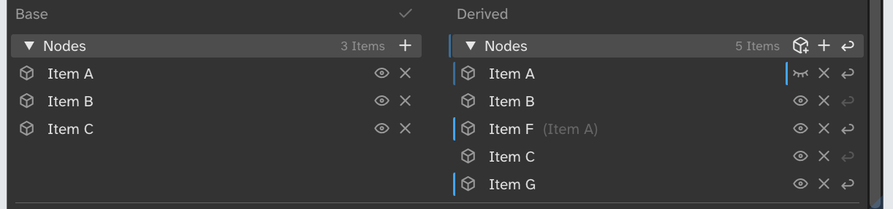
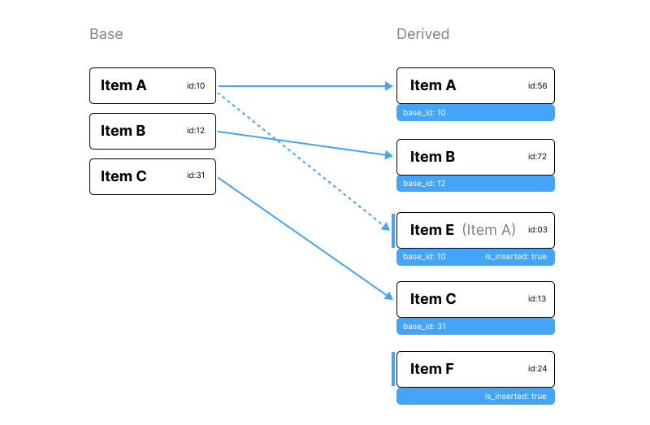
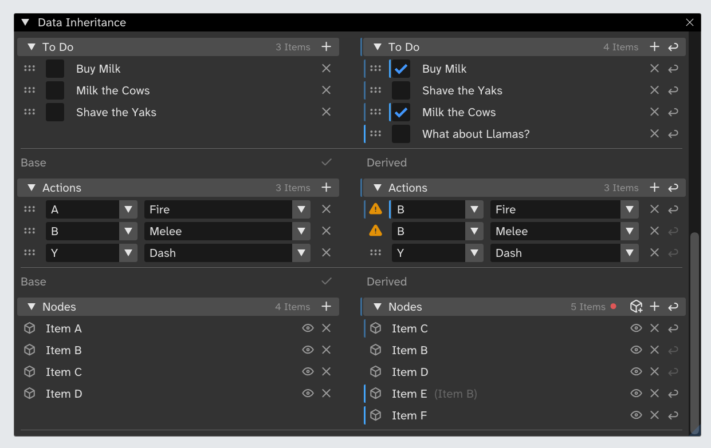

# Data Inheritance


This article and source code explains a simple implementation of data inheritance. Data inheritance means that you can create variations of existing data, override values, and any changes to the base data will update to the derived data when it is changed.

Prefabs, prefabs variants, and nested prefabs are the most common applications of data inheritance in game dev. But it does not need to be limited to just that. Any asset or data type could and should support data inheritance. This article tries to lay down some tools to be able to do that.

The whole stack for a data asset could look like this:

- **Data Inheritance**: abstraction over how to transfer changes to base data to derived data
- **Hierarchical data**: abstraction over composing data from different types of data (e.g. entities & components, json)
- **Type System and Reflection**: abstraction over types and properties
- **Serialization**: abstraction over how data gets stored on disk or buffers
- **Asset Database**: abstraction over how assets are loaded and referenced

This article focuses on the **data inheritance** specifically to make the concepts easy to follow.


## Inheritance Model

We choose to represent the *base data* and *derived data* using the same data types, structs in the examples below. In addition, we have metadata, an override flag, that is used to indicate if the value is different from the base data. This allows the derived data to be as fast and easy to access as the base, and it is even possible to snapshot a version and wipeout all the metadata for a release version of asset.



Things get more complicated with containers like arrays. A big part of this article is to try to explain how to extend the basic idea to work with containers.

There are two common ways to represent how the derived data differs from the base: delta (implicit), and flags (explicit). With the delta method, a simple diff is done after the data has been changed to find the items that are different compared to the base data. With the explicit flag method, data is marked as overridden when it is changed.

We choose explicit flag, since it is just a lot simpler to implement. In both cases it is important that if the override flag is set, it will stay set until the user clears it. Otherwise you get value drifts, which are really hard to debug and reason about.

An example of value drift is that if base data has property A that is set to 2, and derived data now changes that to 3 and override flag is set. If base data is now changed to 3, the diff will think that no override is present, and any further changes to the base data will cause derived to change too. In the cases I have had to debug, the drift has been super rare and has happened over long period of time (months).


## The Override flag



The override flag works simply by having a bit of extra information in the derived data whether a property is overridden or not. At its simplest it could look something like this:

```C
struct {
	shape_type_t shape;
	float size;
	// Meta
	bool override_shape;
	bool override_size;
} collision_shape_t;
```

For every bit of data, we have associated override flag. To set a value, you would do this:

```C
void set_size(collision_shape_t* shape, float new_size)
{
	shape->size = new_size;
	// Only set the flag is we're working with derived object.
	if (shape_is_derived(shape))
		shape->override_size = true;
}
```

I'm intentionally leaving out the implementation of `shape_is_derived()` as I imagine it is part of the *Hierarchical Data* level depicted above. The overall data container, the file, or component, or node should know if it is derived and where to find the base data.

To update the data from base to derived, we can simply do this:

```C
void update_inherited_data(const collision_shape_t* base, collision_shape_t* derived)
{
	if (!derived->override_shape)
		derived->shape = base->shape;
	if (!derived->override_size)
		derived->size = base->size;
}
```

That is, we simply just copy over the data that is not overridden.

### Enums bitflags



We need to pay some extra attention when dealing with enum bitflags. One way to look at the bit flags is to treat them as a set of booleans. That is, the bit name is kind of the variable name. This also implies that we need an override flag per enum bit. 

Let's say we add `hit_flags` bit flags to our collision shape, like this:

```C
typedef enum {
	HIT_STATIC = 1 << 0,
	HIT_DYNAMIC = 1 << 1,
	HIT_SENSOR = 1 << 2,
} hit_flags_t;

typedef struct {
	shape_type_t type;
	float size;
	uint8_t hit_flags;
	// Meta
	bool override_type;
	bool override_size;
	uint8_t override_hit_flags;
} collision_shape_t;
```

Then we can use the same storage type and same bits for the override as we use for the bit flags. As we set or clear a bit, we also set the associated override bit.

We can use cool bitmask trick to copy the overridden bits over without conditions:

```C
void update_inherited_data(const collision_shape_t* base, collision_shape_t* derived)
{
	...
	derived->hit_flags = 
		(derived->hit_flags & derived->override_hit_flags) 
		| (base->hit_flags & ~derived->override_hit_flags);
}
```

That is: `(overridden bits from derived) | (non-overridden bits from base)`.

(Interestingly there is a trick to do that in just 3 instructions: https://realtimecollisiondetection.net/blog/?p=90)

All of the above looks very repetitive, and it can be quite easily automated using a reflection system and some per property attributes. In the automated case you probably want to store the meta data on separate collection, which makes it even simpler to strip it out if you want to disable the inheritance for your release data.


## Collections

Things get more complicated when we have arrays of data. We have to consider things like how do we match the array entries between base and derived data? What if someone removes an item from base, or what if we delete an item in derived that is also present in base? Or add a new item, or reorder items?

So the main challenges are: 
- how do we relate data between base and derived data?
- and, how to maintain the order of the data?

Next we'll look into a couple of different solutions for common use cases.
 
One more thing to note about arrays is that, the arrays we use to store values can have different use semantics. Sometimes we want only unique items (a set), sometimes the order matters, sometimes does not, and sometimes the order can be deduced from the data itself.

We're going to look at 6 different types of containers which cover most of the use cases for creative tools and games:
- **Set**: we want a collection of items that are all unique, for example a tag container.
- **Sorted Array**: we store items in an array, but the order comes from sort, for example a curve or gradient.
- **Un-ordered Array**: we store items in an array, but the order does not matter at all, for example node graph nodes
- **Ordered Array**: the items in the array have specific order and we want to maintain it, or we want to keep the order to allow the user to organize the array, for example a todo list. 
- **Ordered Map**: each item in the collection is identified by unique data the user can set, for example button bindings table.
- **Array of Objects**: there are special considerations for objects, for example node hierarchy.

### Which Type to Choose?

In general, we should allow users to organize their data, and this might contradict to what the container type does (sets and maps). For that reason many of the types in the list are ordered. There are many use case where the ordering does not matter for code functionality, but it might be important to allow the users to organize the data.

Sorted arrays is an example where the data is always strictly ordered based on the properties of the data. Some examples are timelines, gradients and value based lookup tables, where the data's position is their natural ordering.

Sets work well for enum type of data, like tags or collection of actual enums. That way they usually have some specific internal ordering, as well as compact data representation. 

Maps are really hard to represent in the UI, and an ordered array with editing validation and addition index for faster lookup is just about always the right choice. This covers things like mapping buttons to actions.

If the IDs of the items stored in the array need to be globally unique, the Array of Objects covers the issues related to that. The details presented in that section can be also applied to non-sorted array of objects.


## Set



A set is a collection of items where each item exists inly once. This makes it really easy to relate the data between base and derived containers.

The most common use for set is gameplay tag collection, aka user-defined-mega-enum. As already hinted, sets with finite amount of items can be thought as an extension of enum. 

To follow our override strategy from previous example, we can define an overridable set with a regular array of tags that should be included, and another array of tags in metadata that describes the tags that has been overridden. Just like we did for enum bit flags.

In this example we assume that each tag can be represented using an integer, in practice there is usually some central system that assigns ids to the tags, either via string interning or some other method.

```C
typedef int32_t tag_t; 

typedef struct {
	tag_t tags[MAX_TAGS];
	int32_t tags_count;
	// Meta
	tag_t overrides[MAX_TAGS];
	int32_t overrides_count;
} tag_container_t;
```

> **Note**: To simplify the example code, I did not use dynamic arrays (C does not natively support them), but static arrays and count instead. You may want to use dynamic arrays of your choice in your code.


If the user adds or removes tag on the derived tag container, then we add unique entry to `overrides` (the same way we added a bit to the enum flags). That is, the values in the `overrides` describe if the specific tag was ever changed, and `tags` describe their existence.

The merging is the same as with enum too, `(overridden tags from derived) | (non-overridden tags from base)`.

```C
void tags_update_inherited_data(const tag_container_t* tags_base, tag_container_t* tags_derived)
{
	tag_t results[MAX_TAGS] = {0};
	int32_t results_count = 0;

	// Overridden tags from derived
	for (int32_t i = 0; i < tags_derived->tags_count; i++) {
		const tag_t tag_id = tags_derived->tags[i];
		if (tags_is_override(tags_derived, tag_id))
			results[results_count++] = tag_id;
	}

	// Non-overridden tags from base
	for (int32_t i = 0; i < tags_base->tags_count; i++) {
		const tag_t tag_id = tags_base->tags[i];
		if (!tags_is_override(tags_derived, tag_id))
			results[results_count++] = tag_id;
	}

	// Store result in derived and sort.
	for (int32_t i = 0; i < results_count; i++)
		tags_derived->tags[i] = results[i];
	tags_derived->tags_count = results_count;

	tags_sort(tags_derived);
}
```

We assume the order of the tags is not significant from the codes point of view. Usually we want to know if a tag exists, or iterate over all the tags.

The above merge routine does not try keep try the tags in any specific order. For UI consistency and to enforce their enumness, they are sorted so that the tags appear in same order in the tag picker and in the list.


## Sorted Array



In order to be able to relate data between base and derived, we need something to identify the items uniquely for across referencing. For the set, the items that we stored in the array were also the unique identifiers. But if we want to store arbitrary data, then we need to resort to additional unique identifier per item. Every time a new item is added to the array, it will be assigned a new unique ID.

The simplest thing is a random UID. Using random UIDs allows anyone anywhere to create new IDs without the risk of fearing that two will collide with others (fingers crossed!). This is important in terms of the inheritance, but also for merging changes via version control. The chance of collision will depend on the size of the UID, 8 bytes might be ok, 16 bytes is quite generally accepted as solid base.

> **Note**: In the example code we will use 2 byte pseudo random IDs so that they are easy to visually debug. Do not use 2 bytes in production!

Since we are also more data than just the unique IDs, we can rethink how we store our overrides. We still need to know which items in the array are inserted or removed compared to the base data.

For the items that are new on derived data we store an explicit flag that indicates that they are inserted, `is_inserted`. Since removed items do not have any representation, we use a separate array, like our previous overrides array to store the items that exists in base but are removed in derived data. We call this *discarded list* to avoid confusion with other uses of removed.

Now our data could look as follows.

```C
typedef int32_t unid_t; // Unique ID

typedef struct {
	float pos;
	ImVec4 color;
	// Meta
	unid_t id;
	bool is_inserted;
	bool override_color;
	bool override_pos;
} color_stop_t;

typedef struct gradient {
	color_stop_t stops[MAX_COLOR_STOPS];
	int32_t stops_count;
	// Meta
	int32_t discarded[MAX_COLOR_STOPS];
	int32_t discarded_count;
} gradient_t;
```

We are defining data for a gradient, where each color stop stores `is_inserted` if the stop was added to the derived data, and per property overrides, just like in our collision shape example in the beginning.

In addition to the color stops, the gradient also stores discarded list as meta data. This list contains the IDs of the color stops in base which were removed from derived.

That is, items with `is_inserted` and the discarded list together forms the *override list* from earlier example.

Since the items in the gradient are organized based on their position on the color line, we can use that as the key to sort the items.

```C
void gradient_update_inherited_data(const gradient_t* base_grad, gradient_t* derived_grad)
{
	// Take copy of the derived data before modification.
	color_stop_t result_stops[MAX_COLOR_STOPS];
	int32_t result_stops_count = 0;

	// Keep stops from derived that are inserted.
	for (int32_t i = 0; i < derived_grad->stops_count; i++) {
		const color_stop_t* stop = &derived_grad->stops[i];
		if (stop->is_inserted)
			result_stops[result_stops_count++] = *stop;
	}

	// Keep stops from base which are not overridden, and update property.
	for (int32_t i = 0; i < base_grad->stops_count; i++) {
		const color_stop_t* stop = &base_grad->stops[i];
		// if we have discard override, just skip.
		if (gradient_is_discarded(derived_grad, stop->id))
			continue;
		const int32_t derived_idx = gradient_index_of(derived_grad, stop->id);
		if (derived_idx == INVALID_INDEX) {
			// The item exists only in base, copy over (without base overrides).
			color_stop_t new_stop = {
				.t = stop->t,
				.color = stop->color,
				.id = stop->id,
			};
			result_stops[result_stops_count++] = new_stop;
		} else {
			// If the item exists both in base and derived, we need to merge properties.
			color_stop_t existing_stop = derived_grad->stops[derived_idx];
			// Inherit data
			if (!existing_stop.override_t)
				existing_stop.t = stop->t;
			if (!existing_stop.override_color)
				existing_stop.color = stop->color;
			result_stops[result_stops_count++] = existing_stop;
		}
	}

	// Remove discard overrides that do not exists in base anymore
	for (int32_t i = 0; i < derived_grad->discarded_count; i++) {
		if (gradient_index_of(base_grad, derived_grad->discarded[i]) == INVALID_INDEX) {
			// Could not find in base, remove.
			gradient_remove_discard_at(derived_grad, i);
			i--;
		}
	}

	// Copy results back to derived
	for (int32_t i = 0; i < result_stops_count; i++)
		derived_grad->stops[i] = result_stops[i];
	derived_grad->stops_count = result_stops_count;

	gradient_sort(derived_grad);
}
```

The merge looks very similar to the tag case, but the second loop is now more complicated as it needs to handle property override too. 

We have also one extra loop, which will remove any discard overrides that don't exists anymore in the base. The thinking is that if an item is removed from base it should not ever come back, since we add unique ids to new items. There's once gotcha, though, if the user modifies the base, then saves (which will trigger update), and then does undo, and saves again (update), then it is possible that the same id appears again. Other ways of undoing, like rolling back in version control has similar issues too. One option to handle this is to never automatically remove discarded IDs.

## Un-ordered Array

Unordered array can be implemented just like the sorted array, but just don't sort (doh!). It can be useful for data that has spatial organization like node graph nodes. Or maybe you sort them by z-index, in which case it's sorted array again.


## Ordered Array



The basic idea of unique IDs, per item override flag, and discard list also applies to ordered arrays. The additional detail we need to handle is that output of the update inherited data function will need to maintain the order of the items.

There is no perfect solution to this, as the array simply does not capture enough intent from the user. As simple example, if you add new item to the array at the same location both in base and derived, which one should come first? Or if you added 3 items, should the new items interleaved, or should we merge them as clusters in the order they were added in base or derived? Since it is messy, let's put down some things we wish from the ordered merge:

- *Maintain order*:
	- we assume that modifications in the derived data are in the order the user intended
- *Maintain clusters*:
	- we assume that items that were modified together should stay together
- *Handle common operations predictably*:
	- items added to the end of the derived array should be kept there
	- items added to the beginning of the derived array should be kept there
	- items added to the middle of the base array should appear in their relative position in the derived


The data for this example is a todo list: 

```C
typedef struct {
	bool done;
	char name[MAX_TASK_NAME];
	// Meta
	unid_t id;
	bool is_inserted;
	bool override_array_index;
	bool override_done;
	bool override_name;
} task_t;

typedef struct {
	task_t tasks[MAX_TASKS];
	int32_t tasks_count;
	// Meta
	unid_t discarded[MAX_TASKS];
	int32_t discarded_count;
} todo_list_t;
```

The `is_inserted` per action works the same as before, so does the property overrides, there is new override `override_array_index` which indicates that we have modified the (implicit) ordering, and we want to keep the item similarly positioned as it currently is in the derived array. The container is build similarly as before, we have list of items, and discarded list.


To help us to create a reusable merge, we will make an intermediate representation of the items that is temporarily used during the merge:

```C
typedef struct merge_item {
	unid_t id;
	int32_t base_idx;
	int32_t derived_idx;
	bool is_pinned;
} merge_item_t;

typedef struct array_merge {
	merge_item_t items[MAX_ITEMS];
	int32_t items_count;
	unid_t discarded[MAX_ITEMS];
	int32_t discarded_count;
} merge_array_t;
```

We will make a merge array for both the *base* and *derived* data. The `id` is the ID of the item, we only care about the IDs that are shared by base and derided. The `base_idx` and `derived_idx` describe the index of the given item in either array. Finally `is_pinned` is used only for the derived array, and it marks items which we want to keep in specific order in the output.

We convert from our list of structs to the merge arrays like this:

```C
void todos_update_inherited_data(const todo_list_t* base_todos, todo_list_t* derived_todos)
{
	merge_array_t base = {0};
	merge_array_t derived = {0};

	for (int32_t i = 0; i < base_todos->tasks_count; i++) {
		merge_array_add(&base, (merge_item_t){
			.id = base_todos->tasks[i].id,
			.base_idx = i,
			.derived_idx = INVALID_INDEX,
		});
	}

	for (int32_t i = 0; i < derived_todos->tasks_count; i++) {
		const bool is_override = task_is_override(&derived_todos->tasks[i]);
		merge_array_add(&derived, (merge_item_t){
			.id = is_override ? INVALID_ID : derived_todos->tasks[i].id,
			.base_idx = INVALID_INDEX,
			.derived_idx = i,
			.is_pinned = is_override || derived_todos->tasks[i].override_array_index,
		});
	}
	for (int32_t i = 0; i < derived_todos->discarded_count; i++)
		merge_array_add_discarded(&derived, derived_todos->discarded[i]);

	...
```

For the base merge array we set the `base_idx` and for the derived array we set the `derived_idx`, the first part of the merge process will match the items between the arrays and update the corresponding indices.

Items which have invalid `derived_idx` in the base array mean items that are missing in the derived array, and items with invalid `base_idx` in the derived array means items that they are insert in only in derived array. The inserted items' IDs are left blank, since we know that they are not represented in the base. 

The indices are later used to quickly relocation the original data when we reorder the actual items.

We set the `is_pinned` to all items in the derived merge array, that we wish to be keep in their current order in the final output. Here we have chosen to keep items that are inserted into the derived, and items that have been reordered in the derived array. 

The merge magic will update the changes from `base` to the `derived` merge array, and we convert back to the actions like this:

```C
	...
	
	// Do the magic
	merge_array_reconcile(&base, &derived);

	// Copy back adjusted removed items.
	derived_todos->discarded_count = derived.discarded_count;
	for (int32_t i = 0; i < derived.discarded_count; i++)
		derived_todos->discarded[i] = derived.discarded[i];

	// Combine results and inherit properties.
	task_t results[MAX_TASKS];
	int32_t result_tasks_count = 0;

	for (int32_t i = 0; i < derived.items_count; i++) {
		const int32_t base_idx = derived.items[i].base_idx;
		const int32_t derived_idx = derived.items[i].derived_idx;
		if (derived_idx == INVALID_INDEX) {
			// The item does not exist in derived, create new derived item.
			assert(base_idx != INVALID_INDEX);
			const task_t* base_action = &base_todos->tasks[base_idx];
			task_t new_action = {
				.done = base_action->done,
				.id = base_action->id,
			};
			strcpy(new_action.name, base_action->name);
			results[result_tasks_count++] = new_action;
		} else {
			// Copy item from original array.
			assert(derived_idx != INVALID_INDEX);
			task_t existing_item = derived_todos->tasks[derived_idx];
			// Inherit data
			if (base_idx != INVALID_INDEX && !existing_item.is_inserted) {
				const task_t* base_action = &base_todos->tasks[base_idx];
				if (!existing_item.override_done)
					existing_item.done = base_action->done;
				if (!existing_item.override_name)
					strcpy(existing_item.name, base_action->name);
			}
			results[result_tasks_count++] = existing_item;
		}
	}

	// Copy results back to derived.
	derived_todos->tasks_count = result_tasks_count;
	for (int32_t i = 0; i < result_tasks_count; i++)
		derived_todos->tasks[i] = results[i];
}
```

This is similar to the copy from base loop before, which also contained merging the property overrides.

Now let's take a look at the actual ordered merge:

```C
void merge_array_reconcile_ordered(merge_array_t* base, merge_array_t* derived)
{
	// Match derived to base.
	for (int32_t i = 0; i < derived->items_count; i++) {
		merge_item_t* item = &derived->items[i];
		// If this derived item has matching base item, try to match them across.
		item->base_idx = INVALID_INDEX;
		if (item->id != INVALID_ID) {
			item->base_idx = merge_array_find_by_base_id(base, item->id);
			if (item->base_idx == INVALID_INDEX) {
				// The matching item in base was removed, remove derived item too.
				merge_array_remove_at(derived, i);
				i--;
				continue;
			}
			// Mark matching base pinned too so that we know to skip it..
			base->items[item->base_idx].is_pinned = item->is_pinned;
			base->items[item->base_idx].derived_idx = item->derived_idx;
		} else {
			// This item does not exist on base, it's inserted to derived and must be pinned.
			item->is_pinned = true;
		}
	}

	// Remove items from the base, that are removed in derived.
	for (int32_t i = 0; i < derived->discarded_count; i++) {
		// Validate removes
		const int32_t base_idx = merge_array_find_by_base_id(base, derived->discarded[i]);
		if (base_idx == INVALID_INDEX) {
			// The remove is not found in parent, remove it.
			merge_array_remove_discarded_at(derived, i);
			i--;
			continue;
		}
		// Item is removed, do not try to merge it.
		merge_array_remove_at(base, base_idx);
	}
	
	...
```

In the first loop we match items between base and derived, and exchange the indices of the items that match. Then we remove all the discarded items from the base array as if they never existed. After this the derived array contains runs of pinned items (inserted or reordered), and runs of items that should be copied from the base data as is. The base array contains only the items that we should carry over to the derived data.

The main idea of the next merge step is to iterate both arrays in lock step, and take pinned (overridden) items from the derived array, and non-pinned items from the base. We are going to use the derived array as template for ordering. If there is a run of pinned items in the derived array, we will take them. For a run of non-pinned items, we take equal amount of (non-pinned) items from base. If we encounter new item from base while we are adding items from base, they will be added "for free" and do not contribute against the count we set to copy from.

```C
	...
	
	// Iterate over base and derived, picking pinned sections from derived, 
	// and non-pinned or new base items from base.
	merge_item_t results[MAX_ITEMS];
	int32_t results_count = 0;
	int32_t cur_base_idx = 0;
	int32_t cur_derived_idx = 0;
	while (cur_base_idx < base->items_count || cur_derived_idx < derived->items_count) {
		if (cur_derived_idx < derived->items_count && derived->items[cur_derived_idx].is_pinned) {
			// Modified section, keep as is
			while (cur_derived_idx < derived->items_count 
					&& derived->items[cur_derived_idx].is_pinned) {
				results[results_count++] = derived->items[cur_derived_idx];
				cur_derived_idx++;
			}
		} else {
			// Skip unmodified section from derived, keep track how many we skipped.
			int32_t count = 0;
			while (cur_derived_idx < derived->items_count 
					&& !derived->items[cur_derived_idx].is_pinned) {
				cur_derived_idx++;
				count++;
			}
			// Add skipped amount of unmodified items, or adjacent items that were added to the base.
			while (cur_base_idx < base->items_count 
					&& (count > 0 || base->items[cur_base_idx].derived_id == INVALID_ID)) {
				if (!base->items[cur_base_idx].is_pinned) {
					results[results_count++] = base->items[cur_base_idx];
					// New items do not count against the quota.
					if (base->items[cur_base_idx].derived_idx != INVALID_INDEX)
						count--;
				}
				cur_base_idx++;
			}
		}
	}

	// Copy result to derived
	derived->items_count = results_count;
	for (int32_t i = 0; i < results_count; i++)
		derived->items[i] = results[i];
}
```
The result will combine items from base and derived in order they appear in each array. Clusters of changes in derived are maintained, and changes in base appear in the nearest cluster of items from base.

Reordering the items in base will not change the cluster sizes in derived. That is, if you inserted item F after item A from base in the derived data, and item A is reordered, item F will not move along. This might not be always expected, but makes the merge more predictable. Clusters of items at the start and end of array will always keep their position.


### Alternatives ways to order the data

Fractional indexing is a quite popular option for array ordering, especially in the web space. The idea is to assign an index (that is fractional) to each item, and use sorting to reorder the items after merge. When a new item is inserted, it's index is midway between the adjacent items. This method has some downsides like empty ranges (when two items are added to same location) and unbounded index length, and item interleaving (items added in same location will get mixed up). 

Longest edit subsequence or longest increasing subsequence could be used to improve the alignment of the merged arrays. Particularly when items are reordered in the base array. I have tested with quite a few alignment options, and they work most of the time, but sometimes the results can be quite unpredictable, particularly if an item was reordered to opposite end. Quite a bit of heuristics might be needed to get stable feeling results.

## Ordered Map



Maps and Set both are _exceptionally_ hard to handle in the user interface, even without any data inheritance.

For example, we might have a mapping from button codes to actions, say we start with this map:

- **Button A** -> Jump
- **Button B** -> Fire

Now if we wanted to switch over the buttons in the UI, might change the first item's key from **A** to **B**. But that would override the existing **B,** and we would lose data. Sets have similar issue, and should be left for data that can be thought as tags containers and such.

One option to implement maps is to just treat them as ordered arrays, then add validation and lookup index. Ordered array has predictable UI workflows, and you can use validation to mark duplicate entries. A separate lookup index allows map-like fast query, and graceful handling of duplicates (e.g. do not add duplicates, or last item wins, etc).


## Array of Objects



So far we have dealt with items with IDs which are locally identified per container. The IDs have influence only across the chain of derived assets.

There are cases where the ID assigned to an item represents an object in the whole system or within an asset. In such cases we need to store extra data to match the IDs to their counterpart in base data, we call this addition reference `base_id`.



The `base_id` may also be used for other purpose than correlating data between related arrays. Another object could be also used as a template for newly created item. Nested prefabs are good example of such setup. This changes the semantics of the `base_id` since now it describes the inheritance chain, not just array relation.

By using the `is_inserted` flag we can differentiate the cases where we added a new item that is derived from some object, vs. cases where we have inherited an item in an array.

```C
typedef struct node_ref {
	char name[24];
	unid_t id;
	// Meta
	bool is_inserted;
	unid_t base_id;
	bool override_array_index;
} node_ref_t;

typedef struct node_ref_array {
	node_ref_t nodes[MAX_NODES];
	int32_t nodes_count;
	// Meta
	unid_t discarded[MAX_NODES];
	int32_t discarded_count;
} node_ref_array_t;
```

For merging object arrays, we are going to use the same merge array as before:

```C
void nodes_update_inherited_data(const node_ref_array_t* base_nodes, node_ref_array_t* derived_nodes)
{
	merge_array_t base = {0};
	merge_array_t derived = {0};

	for (int32_t i = 0; i < base_nodes->nodes_count; i++) {
		merge_array_add(&base, (merge_item_t){
			.id = base_nodes->nodes[i].id,
			.base_idx = i,
			.derived_idx = INVALID_INDEX,
		});
	}

	for (int32_t i = 0; i < derived_nodes->nodes_count; i++) {
		const bool is_inserted = derived_nodes->nodes[i].is_inserted;
		merge_array_add(&derived, (merge_item_t){
			.id = is_inserted ? INVALID_ID : derived_nodes->nodes[i].base_id,
			.base_idx = INVALID_INDEX,
			.derived_idx = i,
			.is_pinned = is_inserted || derived_nodes->nodes[i].override_array_index,
		});
	}
	for (int32_t i = 0; i < derived_nodes->discarded_count; i++)
		merge_array_add_discarded(&derived, derived_nodes->discarded[i]);

	...
```

The object ids in the base and derived do not match, but we can use the `id` from the base array, `base_id` from the derived array to match the items to merge. Note, how we only set the id for nodes that are _not_ created in the derived data, even if they might have valid `base_id`. This allows a new item inserted in the derived array to inherit from any object in the base.

```C
	...

	merge_array_reconcile(&base, &derived);

	// Copy adjusted removed items.
	derived_nodes->discarded_count = derived.discarded_count;
	for (int32_t i = 0; i < derived.discarded_count; i++)
		derived_nodes->discarded[i] = derived.discarded[i];

	// Combine results and inherit properties.
	node_ref_t result_nodes[MAX_NODES];
	int32_t result_nodes_count = 0;

	for (int32_t i = 0; i < derived.items_count; i++) {
		const int32_t base_idx = derived.items[i].base_idx;
		const int32_t derived_idx = derived.items[i].derived_idx;
		if (derived_idx == INVALID_INDEX) {
			// The item does not exist in derived, create new derived node.
			assert(base_idx != INVALID_INDEX);
			const node_ref_t* base_node = &base_nodes->nodes[base_idx];

			node_ref_t new_node = {
				.id = gen_id(),
				.base_id = base_node->id,
				.is_visible = base_node->is_visible,
			};
			memcpy(new_node.name, base_node->name, sizeof(new_node.name));

			result_nodes[result_nodes_count++] = new_node;
		} else {
			// Copy node from original array.
			assert(derived_idx != INVALID_INDEX);
			node_ref_t existing_node = derived_nodes->nodes[derived_idx];
			// Inherit data
			const int32_t base_node_idx = nodes_index_of(base_nodes, existing_node.base_id);
			if (base_node_idx != INVALID_INDEX) {
				const node_ref_t* base_node = &base_nodes->nodes[base_node_idx];
				if (!existing_node.override_is_visible)
					existing_node.is_visible = base_node->is_visible;
			} else {
				// Clear out base node reference if it is not valid anymore.
				existing_node.base_id = INVALID_ID;
			}

			result_nodes[result_nodes_count++] = existing_node;
		}
	}

	// Copy results back to derived.
	derived_nodes->nodes_count = result_nodes_count;
	for (int32_t i = 0; i < result_nodes_count; i++)
		derived_nodes->nodes[i] = result_nodes[i];
}
```

We use the same merge as in ordered array. The handling of the inherited nodes is a bit different since we now handle both inherited nodes and derived nodes (the nested prefab thing).


## The UI



The challenge for the override visualization is that it needs to work with many different types of widgets and contexts. A fairly common way to represent an overridden property is drawing a colored (usually blue) vertical line at the beginning of the changed line. It is not too distracting, yet quick to recognize at glance. The simple shape is quite easy to slap next to just about any widget.

We should also have a way to indicate that there are overrides within a data container (object, array, etc). This allows to quickly see where the overridden data is even if the actual data is outside the view or inside collapsed UI. In the prototype I'm using the same indicator, but dimmer.

The override indicator also should be granular enough that if you have laid out multiple widgets on the same row, each of them can be highlighted out separately.

One property that is invisible is the array item order. I tested with various ways to visualize that, but they all felt really heavy. In the end I settled on just showing that "something has changed on these rows". I feel like some indicator would be in order.


One challenge I faced in this prototype was how to apply the indicator to markers, like keyframes. Many options I tried felt too much like the marker was selected. I eventually settled in a horizontal line over the marker, as it did not look like anything that felt like it had meaning on the timeline.

In addition to the indicator we also need a way to revert the changes. For widget rows, the easiest is to have a button, or an option in right click menu. Some applications seem to combine the revert button and per row override indicator, which can also be a good idea.

Removed items need extra care, since they are not represented in the UI. I chose to include simple red indicator next to the item count to signal that items have been removed from the container. The indicator also has quick preview of the items as tooltip.

The revert button on the container header allows all the changes to be reverted, or more granular way to revert the removed items. Laying multiple items on the same line also creates issue for the revert UI. In this prototype I chose to summon a menu, which allows the whole row to be reverted or individual items. 

I don't like how in this prototype the revert is different for the single property vs multi property case. Maybe the revert could always be full row, and you would use right click to summon the more details options.

The revert UI can get as complex as the rest of the UI. We are essentially building a tool that handles the invisible connections between two documents.

## Conclusion

A robust and efficient solution for data inheritance can be hard to implement, since many decisions require making decisions across the whole tech stack from low level representation to the UI. I hope this article could provide some guidance, and maybe the prototype can be used to test some ideas out.

## Prototype Project

The project contains prototype/demo code. The code is written in C using [Dear ImGui](https://github.com/ocornut/imgui) as the GUI library, and [Dear Bindings](https://github.com/dearimgui/dear_bindings) as C API. 

### Building

The project uses CMake for build config.

- Install [CMake](https://cmake.org/)
- Ensure CMake is in the user `PATH`
- `mkdir build`
- `cd build`
- `cmake ..`
- Build
	- *Windows*: Open and build `build/array_merge.sln`
	- *Linux*: use `cmake --build . -j$(nproc)`
	- *macOS*: use `cmake --build . -j$(sysctl -n hw.ncpu)`

You may need to adjust the debugger working directory in the IDE to `build/src`.
